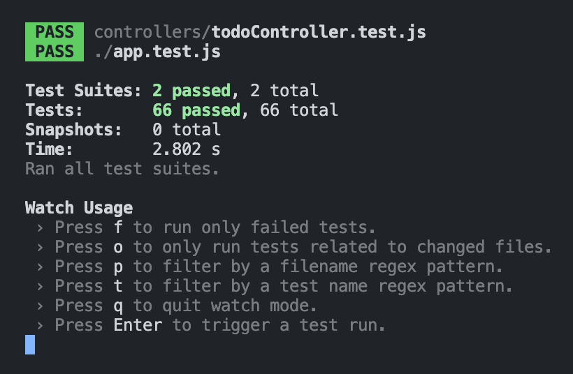

# How to build an Express Todo API with PostgreSQL Database setup

* This project is simply to outline the processes involved in setting up an Express API with a PostgreSQL database.
* This example uses `todos` but the principle is the same for any API.
* Code files included are purely intended as a comprehenisve example of the instructions provided in this README.md file.
* The order in which the API and database are made are optional. These instructions provide one possible order.

## Set up

The purpose of this project is a README guide, not to run the API, but should you wish to then follow these steps:
* Clone this repository.
* Run `npm install` to install the dependencies.
* Create a `.env` file in the root of the project and add the following environment variables:
  * `DB_USERNAME=your_username`
  * `DB_PASSWORD=your_password`
* Replace `your_username` and `your_password` with your PostgreSQL username and password.
* Create a database called `todolist` in PostgreSQL.
* Run the `tables.sql` and `seeds.sql` files in the `db` folder to create the tables and seed the database.
* Run `npm start` to start the server.
* Use a tool like Postman to make requests to the API.
* Run `npm test` to run the tests.

## Contents

1. [Setting up the repository](#setting-up-the-repository)
2. [Setting up the database](#setting-up-the-database)
3. [Prepare for using the database in the API](#prepare-for-using-the-database-in-the-api)
4. [Server 1 - Basic Server Setup](#server-1---basic-server-setup)
5. [Server 2 - Middleware and First Route](#server-2---middleware-and-first-route)
6. [GET /todos 1 - First Todo Route](#get-todos-1---first-todo-route)
7. [GET /todos 2 - Refactor the todo route](#get-todos-2---refactor-the-todo-route)
8. [GET /todos 3 - Add the first controller function unit test](#get-todos-3---add-the-first-controller-function-unit-test)
9. [GET /todos/:id 1 - Basic getTodoById controller function and unit test](#get-todosid-1---basic-gettodobyid-controller-function-and-unit-test)
10. [GET /todos/:id 2 - Error handling in the getTodoById controller function and unit testing errors](#get-todosid-2---error-handling-in-the-gettodobyid-controller-function-and-unit-testing-errors)
11. [GET /todos/:id 3 - Add the single todo route and write integration tests](#get-todosid-3---add-the-single-todo-route-and-write-integration-tests)
12. [POST /todos 1 - Basic addTodo controller function and unit tests](#post-todos-1---basic-addtodo-controller-function-and-unit-tests)
13. [POST /todos 2 - Error handling in the addTodo controller function and unit testing errors](#post-todos-2---error-handling-in-the-addtodo-controller-function-and-unit-testing-errors)
14. [POST /todos 3 - Add the addTodo route and write integration tests](#post-todos-3---add-the-addtodo-route-and-write-integration-tests)
15. [DELETE /todos/:id 1 - Basic deleteTodo controller function and unit tests](#delete-todosid-1---basic-deletetodo-controller-function-and-unit-tests)
16. [DELETE /todos/:id 2 - Error handling in the deleteTodo controller function and unit testing errors](#delete-todosid-2---error-handling-in-the-deletetodo-controller-function-and-unit-testing-errors)
17. [DELETE /todos/:id 3 - Add the deleteTodo route and write integration tests](#delete-todosid-3---add-the-deletetodo-route-and-write-integration-tests)
18. [PUT /todos/:id 1 - Basic updateTodo controller function and unit tests](#put-todosid-1---basic-updatetodo-controller-function-and-unit-tests)
19. [PUT /todos/:id 2 - Error handling in the updateTodo controller function and unit testing errors](#put-todosid-2---error-handling-in-the-updatetodo-controller-function-and-unit-testing-errors)
20. [PUT /todos/:id 3 - Add the updateTodo route and write integration tests](#put-todosid-3---add-the-updatetodo-route-and-write-integration-tests)
21. [Notes on the Tests in this Repo](#notes-on-the-tests-in-this-repo)


## Setting up the repository

Create a local directory for the project and navigate to it in the terminal. 
Initialise npm and git, install dependencies and dev dependencies, and create the required folders and files.
```
npm init -y
git init
npm i express dotenv pg
npm i -D jest supertest
mkdir controllers routes utils
touch .env .gitignore server.js app.js app.test.js db.js seeds.sql tables.sql utils/resetDbData.js routes/todoRoutes.js controllers/todoController.js controllers/todoController.test.js
```
Add required file exemptions to .gitignore, e.g.
```
node_modules
.DS_Store
.env
```

## Setting up the database

Assuming that PostgreSQL is installed, create a database and a user with the required permissions.
```
createdb todolist
```

### Set up tables

In the tables.sql file, create the required tables for the project. For example:
```
DROP TABLE IF EXISTS todos;

CREATE TABLE todos (
  id SERIAL PRIMARY KEY,
  task VARCHAR(255) NOT NULL,
  completed BOOLEAN DEFAULT false
);

-- psql -h 127.0.0.1 todolist < tables.sql
-- psql -h 127.0.0.1 todolist < seeds.sql
```

The last two lines of this are the commented out commands to run the tables.sql and seeds.sql files in the terminal.

### Set up seeds

In the seeds.sql file, add some initial data to the tables. For example:
```
TRUNCATE TABLE todos RESTART IDENTITY CASCADE;

INSERT INTO todos (task, completed) VALUES
('Eat', true),
('Sleep', false),
('Pray', false)
;

-- psql -h 127.0.0.1 todolist < tables.sql
-- psql -h 127.0.0.1 todolist < seeds.sql
```

### Set up scripts for setting up tables and seeding data

In `package.json` add to scripts:
```bash
"db:tables": "psql -h 127.0.0.1 todolist < tables.sql",
"db:seed": "psql -h 127.0.0.1 todolist < seeds.sql",
"db:reseed": "psql -h 127.0.0.1 todolist < tables.sql && psql -h 127.0.0.1 todolist < seeds.sql"
```

### Create and seed the database tables

In the terminal, either:
```bash
npm run db:reseed
```
OR
```bash
psql -h 127.0.0.1 todolist < tables.sql
psql -h 127.0.0.1 todolist < seeds.sql
```

## Prepare for using the database in the API

### Setup environment variables

In the .env file, add the environment variables required for the database connection. For example:
```
DATABASE_USER=your_username
DATABASE_PASSWORD=your_password
```

### Setup database connection

In the db.js file, create a connection to the PostgreSQL database. For example:
```
require('dotenv').config();
const { Pool } = require('pg');

const pool = new Pool({
  user: process.env.DATABASE_USER,
  password: process.env.DATABASE_PASSWORD,
  database: 'todolist',
  host: 'localhost',
  port: 5432
})

module.exports = pool;
```

### Write a function to reset the database data

In the utils/resetDbData.js file, write a function to reset the database data. For example:
```
const pool = require('../db');

const resetDbData = async () => {
  const resetQuery = `
    TRUNCATE TABLE todos RESTART IDENTITY CASCADE;

    INSERT INTO todos (task, completed) VALUES
    ('Eat', true),
    ('Sleep', false),
    ('Pray', false);
  `;

  try {
    await pool.query(resetQuery);
  } catch (error) {
    console.log('Error resetting database', error);
    throw error;
  }
};

module.exports = resetDbData;
```

## Server 1 - Basic Server Setup

### Setup the basic server

In the app.js file, create the Express server and set up the required middleware. For example:
```javascript
const express = require('express');

const app = express();

module.exports = app;
```

In the server.js file, start the server. For example:
```javascript
const app = require('./app');
const PORT = process.env.PORT || 3000;

app.listen(PORT, () => {
  console.log(`Server running on port ${PORT}`);
});
```

### Write scripts for starting the server and running tests

In the package.json file, add the following scripts:
```
"scripts": {
  "start": "node --watch server.js",
  "test": "jest --watchAll --detectOpenHandles"
}
```

### Start the server

```bash
npm start
```

## Server 2 - Middleware and First Route

### Add middleware to app.js

Add middleware to app.js to parse JSON and handle errors, below where the app is created.

```javascript
app.use(express.json());

app.use((err, req, res, next) => {
  const status = err.status || 500;
  res.status(status).json({ message: err.message });
});
```

### Create the first route

Add a simple home route **after** the `json` middleware and **before** the error handling middleware in app.js.

```javascript
app.get('/', (req, res, next) => {
  try {
    res.status(200).json({message: "Home endpoint is working!"})
  } catch (error) {
    next (error);
  }
});
```

### Manually test the first route

This can be tested in the browser or using a tool like Postman by making a `GET` request to `http://localhost:3000/`.

**NOTE:** The server must be running for this to work.

## GET /todos 1 - First Todo Route and Integration Test

### Import pool into app.js

```javascript
const pool = require('./db');
```

### Create the todo route in app.js

In the app.js file, create the todo route. For example:
```javascript
app.get('/todos', async (req, res, next) => {
  const getAllTodosQuery = 'SELECT * from todos';

  try {
    const results = await pool.query(getAllTodosQuery);
    res.status(200).json(results.rows);
  } catch (error) {
    next(error);
  }
})
```

### Manually test the todo route

As before, in browser or Postman, make a `GET` request to `http://localhost:3000/todos`.

### Write an integration test for the todo route

In the app.test.js file, import `app`, `request` from `supertest` and the `resetDbData` function.

```javascript
const request = require('supertest');
const app = require('./app');
const resetDbData = require('./utils/resetDbData');
```

Start with an overarching `describe` block and a `beforeEach` block to reset the database data before each test.

```javascript
describe('App todo endpoint integration tests', () => {
  beforeEach(async () => {
    await resetDbData();
  });
})
```

Write a test for the `GET` request to `/todos` inside the overarching `describe` block.

```javascript
describe('GET /todos', () => {
    test('should return an array of all todos and status 200', async () => {
      // Act
      const response = await request(app).get('/todos');
      // Assert
      expect(response.status).toBe(200);
      expect(response.body.length).toBe(3);
      expect(response.body[0].task).toBe('Eat');
      expect(response.body[1].completed).toBe(false);
    })
  })
```

**NOTE:** The exact tests you choose are fairly optional.

### Run the integration tests

```bash
npm test
```

## GET /todos 2 - Refactor the todo route into routes and controllers

This stage is all about moving the endpoint that was just written into specific route and controller files.

### Create the todo controller function

Import `pool` into the todoController.js file so that the controller function can access the database.

```javascript 
const pool = require('../db');
```

The logic for the todo route should be moved from `app.js` into the controller file, `todoController.js`, in the `controllers` folder.
```javascript
const getAllTodos = async (req, res, next) => {
  const getAllTodosQuery = 'SELECT * from todos';

  try {
    const results = await pool.query(getAllTodosQuery);
    res.status(200).json(results.rows);
  } catch (error) {
    next(error);
  }
};

module.exports = {
  getAllTodos,
};
```

### Create the todo route

In the routes/todoRoutes.js file, import the express router and the todo controller, create the router, and export it:
```javascript
const { Router } = require('express');
const router = Router();

const { getAllTodos } = require('../controllers/todoController');

module.exports = router;
```

Betweeen the imports and export, add the first route:
```javascript
router.get('/', getAllTodos);
```

**NOTE:** The route is now just `/` as the `/todos` endpoint root is handled in the app.js file.

### Import and use the todo route into app.js

In the app.js file, import the todo route as `todoRoutes` with the other imports:
```javascript
const todoRoutes = require('./routes/todoRoutes');
```

Use`todoRoutes` between the single home route and the `next` error handling middleware:
```javascript
app.use('/todos', todoRoutes);
```

### Clean up old todo route code in app.js

Remove these snippets of old todo route from app.js:
```javascript
const pool = require('./db');
```
and
```javascript
app.get('/todos', async (req, res, next) => {
  const getAllTodosQuery = 'SELECT * from todos';

  try {
    const results = await pool.query(getAllTodosQuery);
    res.status(200).json(results.rows);
  } catch (error) {
    next(error);
  }
})
```
At this point, you could also remove the `home` route from app.js, whose purpose was only to test the server was working.

### Check app.test.js integration test still passes

The `app.js` file should now look ike this:
```javascript
const express = require('express')
const todoRoutes = require('./routes/todoRoutes')

const app = express()

app.use(express.json())

app.use('/todos', todoRoutes)

app.use((err, req, res, next) => {
  const status = err.status || 500
  res.status(status).json({ message: err.message })
})

module.exports = app
```

The `app.test.js` file test for the `/todos` route should still pass as should any manual test in the browser or Postman.

## GET /todos 3 - Unit testing the getAllTodos controller function

### import required files into the controller test file

Create a test file, `todoController.test.js`, in the `controllers` folder and import `getAllTodos` and `resetDbData`.

```javascript
const resetDbData = require('../utils/resetDbData');
const { getAllTodos } = require('./todoController');
```

### Set up over-arching `describe` block and `beforeEach` block

```javascript
describe('Todo routes controller functions unit tests', () => {

  beforeEach( async () => {
    await resetDbData();
  });
})
```

### Write a test for the `getAllTodos` function

```javascript
describe('getAllTodos()', () => {
    test('should return an array of all todo objects and status 200', async () => {
      // Arrange
      const mReq = {};
      const mRes = {
        status: jest.fn().mockReturnThis(),
        json: jest.fn()
      }
      const mNext = jest.fn();

      // Act
      await getAllTodos(mReq, mRes, mNext);

      // Assert
      expect(mRes.status).toBeCalledWith(200);
      expect(mRes.json.mock.calls[0][0].length).toBe(3);
      expect(mRes.json.mock.calls[0][0][0].task).toBe('Eat');
      expect(mRes.json).toBeCalledWith([{"completed": true, "id": 1, "task": "Eat"}, {"completed": false, "id": 2, "task": "Sleep"}, {"completed": false, "id": 3, "task": "Pray"}])
    })
  })
```

**NOTE:** The last assertion here is an example way of checking the json response that performs a similar function to the preceding two assertions. This latter way is easier to remember and understand but requires the full json response to be known in advance.

### Run the unit tests

```bash
npm test
```

All tests should pass.

**At this point, the first API endpoint is complete, refactored, and fully tested.**

## GET /todos/:id 1 - Basic getTodoById controller function and unit test

### Create the single todo controller function

In the todoController.js file, create the `getTodoById` function:
```javascript
const getTodoById = async (req, res, next) => {
  const { id } = req.params;
  const getSingleTodoQuery = 'SELECT * FROM todos WHERE id = $1';

  try {
    const results = await pool.query(getSingleTodoQuery, [id]);
    res.status(200).json(results.rows);
  } catch (error) {
    next(error);
  }
}
```

**NOTE:** There is currently no error handling for the case where the `id` does not exist in the database or is an invalid type. If no `id` is supplied then the request will reach the all todos endpoint.

### Add getTodoById to the todoController export

```javascript
module.exports = {
  getAllTodos,
  getTodoById
};
```

### Create a 'happy route' test for the single todo controller function

In the todoController.test.js file, add `getTodoById` to the imports.
```javascript
const { getAllTodos, getTodoById } = require('./todoController');
```

Add a `describe` block for the `getTodoById` function and a **parameterised** `test` block for the happy route providing each tyest with `id`, `task`, and `completed` parameters.
```javascript
describe('getTodoById()', () => {
    test.each([
      [1, 'Eat', true],
      [2, 'Sleep', false],
      [3, 'Pray', false],
    ])('should return an array with a single todo object and status 200 when called with the id param of %s', async (id, task, completed) => {
      // Arrange
      const mReq = {
        params: {
          id
        }
      };
      const mRes = {
        status: jest.fn().mockReturnThis(),
        json: jest.fn()
      };
      const mNext = jest.fn();

      // Act
      await getTodoById(mReq, mRes, mNext);

      // Assert
      expect(mRes.status).toBeCalledWith(200);
      expect(mRes.json.mock.calls[0][0].length).toBe(1);
      expect(mRes.json.mock.calls[0][0][0].id).toBe(id);
      expect(mRes.json.mock.calls[0][0][0].task).toBe(task);
      expect(mRes.json.mock.calls[0][0][0].completed).toBe(completed);
      expect(mRes.json).toBeCalledWith([{id, task, completed}])
    })
  })
```

**NOTE:** The `test.each` block is a parameterised test that runs the same test with different parameters. This is a good way to test the same function with different inputs.

**NOTE:** The last assertion in this test is an alternative to the previous three and in this case probably a much better option.

## GET /todos/:id 2 - Error handling in the getTodoById controller function and unit testing errors

### Add a helper function to make the `id` parameter a number
In the controller file, create a `getIdNumber` helper function.
```javascript
const getIdNumber = (req) => {
  let { id } = req.params;
  if (isNaN(id) || id === true) return null;
  return Number(id);
}
```
This validates the `id` parameter and returns it as a number if it can be parsed as such, or `null` if it is not parseable as a number.

### Use getIdNumber in getTodoById
Replace `const { id } = req.params` with `const id = getIdNumber(req)`.

### Validate the `id` parameter type
Right after the `id` is returned from the `getIdNumber` function, add a check to see if it is `null`. If it is, return an error.
```javascript
if (!id) return next({ status: 400, message: `Invalid id provided. ID must be a number.` });
```

### Add error handling for the case where the `id` does not exist in the database
In the `try` block, add a check to see if `results.rows` is empty. If it is, throw an error.
```javascript
if (!results.rows.length) return next({status: 404, message: `No todo with an ID of ${id} could be found in the database.`})
```

The `getTodoById` function should now be:
```javascript
const getTodoById = async (req, res, next) => {
  const id = getIdNumber(req)
  if (!id)
    return next({
      status: 400,
      message: `Invalid id provided. ID must be a number.`,
    })
  const getSingleTodoQuery = 'SELECT * FROM todos WHERE id = $1'

  try {
    const results = await pool.query(getSingleTodoQuery, [id])
    if (!results.rows.length)
      return next({
        status: 404,
        message: `No todo with an ID of ${id} could be found in the database.`,
      })
    res.status(200).json(results.rows)
  } catch (error) {
    next(error)
  }
}
```

### Add controller function tests for invalid and non-existent `id` parameters

Add new parameterised tests providing each test with an `id`, `status`, and `errorMessage` parameter.
```javascript
test.each([
      [2000, 404, 'No todo with an ID of 2000 could be found in the database.'],
      ['dog', 400, 'Invalid id provided. ID must be a number.'],
      [true, 400, 'Invalid id provided. ID must be a number.'],
    ])('should return an appropriate status and error message when called with an ID param of %s', async (id, status, errorMessage) => {
      // Arrange
      const mReq = {
        params: {
          id
        }
      };
      const mRes = {
        status: jest.fn().mockReturnThis(),
        json: jest.fn()
      };
      const mNext = jest.fn();

      // Act
      await getTodoById(mReq, mRes, mNext);

      // Assert
      expect(mRes.status).not.toHaveBeenCalled();
      expect(mNext).toHaveBeenCalledWith({ status, message: errorMessage })
      expect(mNext.mock.calls[0][0].status).toBe(status);
      expect(mNext.mock.calls[0][0].message).toBe(errorMessage);
    })
```

**NOTE:** The second assertion here is an alternative to the third and fourth assertions. Take you pick but there is no point in including both.

## GET /todos/:id 3 - Add the single todo route and write integration tests

### Create the single todo route

Add the `getTodoById` function to the todoController imports.
```javascript
const { getAllTodos, getTodoById } = require('../controllers/todoController');
```

In the routes/todoRoutes.js file, add the single todo route:
```javascript
router.get('/:id', getTodoById);
```

### Add a 'happy route' integration test for the single todo route

Within the over-arching `describe` block in the app.test.js file:
```javascript
describe('GET /todos/:id', () => {
    test.each([
      [1, 'Eat', true],
      [2, 'Sleep', false],
      [3, 'Pray', false]
    ])('should return an array with a single todo and status 200 when called with an ID param of %s', async (id, task, completed) => {
      // Act
      const response = await request(app).get(`/todos/${id}`);

      // Assert
      expect(response.status).toBe(200);
      expect(response.body.length).toBe(1);
      expect(response.body[0].task).toBe(task);
      expect(response.body[0].completed).toBe(completed);
    })
  })
```

### Add integration tests for invalid and non-existent `id` parameters

Within the `GET /todos/:id` `describe` block:
```javascript
test.each([
      [2000, 404, 'No todo with an ID of 2000 could be found in the database.'],
      ['dog', 400, 'Invalid id provided. ID must be a number.'],
      [true, 400, 'Invalid id provided. ID must be a number.']
    ])('should return an appropriate status and error message when called with an ID param of %s', async (id, status, errorMessage) => {
      // Act
      const response = await request(app).get(`/todos/${id}`);

      // Assert
      expect(response.status).toBe(status);
      expect(response.body.message).toBe(errorMessage);
    })
```

## POST /todos 1 - Basic addTodo controller function and unit tests

### Create the basic addTodo controller function

In the todoController.js file, create the `addTodo` function:
```javascript
const addTodo = async (req, res, next) => {
  const { task } = req.body;
  const addTodoQuery = 'INSERT INTO todos (task, completed) VALUES ($1, false) RETURNING *';

  try {
    const results = await pool.query(addTodoQuery, [task]);
    res.status(201).json(results.rows);
  } catch (error) {
    next(error);
  }
};
```

Add `addTodo` to the exports:
```javascript
module.exports = {
  getAllTodos,
  getTodoById,
  addTodo
};
```

### Create 'happy route' tests for the addTodo controller function

In the todoController.test.js file, add `addTodo` to the imports.
```javascript
const { getAllTodos, getTodoById, addTodo } = require('./todoController');
```

Add a `describe` block for the `addTodo` function and a `test` block for the happy route.
```javascript
describe('addTodo()', () => {
    test.each(['Climb', 'Swim', 'Climb a tree'])('should add a todo to the database and return an array with the added todo and status 201', async (task) => {
      // Arrange
      const mReq = {
        body: {
          task
        }
      };
      const mRes = {
        status: jest.fn().mockReturnThis(),
        json: jest.fn()
      };
      const mNext = jest.fn();

      // Act
      await addTodo(mReq, mRes, mNext);

      // Assert
      expect(mRes.status).toHaveBeenCalledWith(201);
      expect(mRes.json.mock.calls[0][0].length).toBe(1);
      expect(mRes.json.mock.calls[0][0][0].task).toBe(task);
      expect(mRes.json.mock.calls[0][0][0].completed).toBe(false);
    })
  })
```

## POST /todos 2 - Error handling in the addTodo controller function and unit testing errors

### Validate the `task` parameter

Right after the `task` is destructured from `req.body`, add a check to see if it is `undefined` or an empty string. If it is, return an error.
```javascript
if (!task) return next({ status: 400, message: `No task was provided.` });
```

Then check to see if the `task` is a string. If it is not, return an error.
```javascript
if (typeof task !== 'string') return next({ status: 400, message: `Task must be a string.` });
```

### Add controller function tests for invalid `task` parameters

Add new parameterised tests providing each test with a `task` and `errorMessage` parameter.
```javascript
test.each([
    [undefined, 'No task was provided.'],
    ['', 'No task was provided.'],
    [212, 'Task must be a string.'],
    [true, 'Task must be a string.'],
  ])('should return status 400 and an appropriate error message when passed task, "%s" in the request body', async (task, errorMessage) => {
    // Arrange
    const mReq = {
      body: {
        task
      }
    };
    const mRes = {
      status: jest.fn().mockReturnThis(),
      json: jest.fn()
    };
    const mNext = jest.fn();

    // Act
    await addTodo(mReq, mRes, mNext);

    // Assert
    expect(mRes.status).not.toHaveBeenCalled();
    expect(mNext).toHaveBeenCalledWith({ status: 400, message: errorMessage });
    expect(mNext.mock.calls[0][0].status).toBe(400);
    expect(mNext.mock.calls[0][0].message).toBe(errorMessage);
  })
```

## POST /todos 3 - Add the addTodo route and write integration tests

### Create the addTodo route

Add the `addTodo` function to the todoController imports.
```javascript
const { getAllTodos, getTodoById, addTodo } = require('../controllers/todoController');
```

Add the addTodo route:
```javascript
router.post('/', addTodo);
```

### Add 'happy route' integration tests for the addTodo route

Within the over-arching `describe` block in the app.test.js file:
```javascript
describe('POST /todos', () => {
    test.each(['Climb', 'Swim', 'Climb a tree'])('should add a todo to the database and return status 201 and an array containing the created todo object', async (task) => {
      // Act
      const response = await request(app).post('/todos').send({ task });

      // Assert
      expect(response.status).toBe(201);
      expect(response.body.length).toBe(1);
      expect(response.body[0].task).toBe(task);
      expect(response.body[0].completed).toBe(false);
    })
  })
```

### Add integration tests for invalid `task` parameters

Within the `POST /todos` `describe` block:
```javascript
test.each([
      [undefined, 'No task was provided.'],
      ['', 'No task was provided.'],
      [212, 'Task must be a string.'],
      [true, 'Task must be a string.'],
    ])('should return status 400 and an appropriate error message when given task value of %s', async (task, errorMessage) => {
      // Act
      const response = await request(app).post('/todos').send({ task });

      // Assert
      expect(response.status).toBe(400);
      expect(response.body.message).toBe(errorMessage);
    })
```

**NOTE:** Traditionally, the `PUT` route comes next but I always feel that it is the most complex of all the routes and so I have left it until last. 

## DELETE /todos/:id 1 - Basic deleteTodo controller function and unit tests

### Create the basic deleteTodo controller function

In the todoController.js file, create the `deleteTodo` function:
```javascript
const deleteTodo = async (req, res, next) => {
  const id = getIdNumber(req);
  const deleteTodoQuery = 'DELETE FROM todos WHERE id = $1 RETURNING *';

  try {
    const results = await pool.query(deleteTodoQuery, [id]);
    res.status(200).json(results.rows);
  } catch (error) {
    next(error);
  }
}
```

Add `deleteTodo` to the exports:
```javascript
module.exports = {
  getAllTodos,
  getTodoById,
  addTodo,
  deleteTodo
};
```

### Create 'happy route' tests for the deleteTodo controller function

In the todoController.test.js file, add `deleteTodo` to the imports.
```javascript
const { getAllTodos, getTodoById, addTodo, deleteTodo } = require('./todoController');
```

Add a `describe` block for the `deleteTodo` function and a `test` block for the happy route.
```javascript
describe('deleteTodo()', () => {
    test.each([
      [1, 'Eat', true],
      [2, 'Sleep', false],
      [3, 'Pray', false]
    ])('should delete todo with id %s from the database and return status 200 and an array containing only the deleted todo object', async (id, task, completed) => {
      // Arrange
      const mReq = {
        params: {
          id
        }
      };
      const mRes = {
        status: jest.fn().mockReturnThis(),
        json: jest.fn()
      };
      const mNext = jest.fn();

      // Act
      await deleteTodo(mReq, mRes, mNext);

      // Assert
      expect(mRes.status).toHaveBeenCalledWith(200);
      expect(mRes.json).toHaveBeenCalledWith([{ id, task, completed }]);
      expect(mRes.json.mock.calls[0][0].length).toBe(1);
      expect(mRes.json.mock.calls[0][0][0].task).toBe(task)
    })
  })
```

## DELETE /todos/:id 2 - Error handling in the deleteTodo controller function and unit testing errors

### Validate the `id` parameter

Right after the `id` is returned from the `getIdNumber` function, add a check to see if it is exists. `getIdNumber` returns `null` if the `id` is not a number.
```javascript
if (!id) return next({ status: 400, message: 'Invalid id provided. ID must be a number.' });
```

And right after the database query, add a check to see if `results.rows` is empty, i.e. the id was not found.
```javascript
if (!results.rows.length) return next({ status: 404, message: `No todo with an ID of ${id} could be found in the database.` });
```

### Add controller function tests for invalid and not found `id` parameters

Add new parameterised tests providing each test with an `id`, `status` and `errorMessage` parameter.
```javascript
test.each([
      ['cat', 400, 'Invalid id provided. ID must be a number.'],
      [true, 400, 'Invalid id provided. ID must be a number.'],
      [2000, 404, 'No todo with an ID of 2000 could be found in the database.'],
    ])('should return an appropriate status and error message when passed params ID of "%s"', async (id, status, errorMessage) => {
      // Arrange
      const mReq = {
        params: {
          id
        }
      };
      const mRes = {
        status: jest.fn().mockReturnThis(),
        json: jest.fn()
      };
      const mNext = jest.fn();

      // Act 
      await deleteTodo(mReq, mRes, mNext);

      // Assert
      expect(mRes.status).not.toHaveBeenCalled();
      expect(mNext).toHaveBeenCalledWith({ status, message: errorMessage });
      expect(mNext.mock.calls[0][0].status).toBe(status);
      expect(mNext.mock.calls[0][0].message).toBe(errorMessage);
    })
```

## DELETE /todos/:id 3 - Add the deleteTodo route and write integration tests

### Create the deleteTodo route

Add the `deleteTodo` function to the todoController imports.
```javascript
const { getAllTodos, getTodoById, addTodo, deleteTodo } = require('../controllers/todoController');
```

Add the deleteTodo route:
```javascript
router.delete('/:id', deleteTodo);
```

### Add 'happy route' integration tests for the deleteTodo route

Within the over-arching `describe` block in the app.test.js file:
```javascript
describe('DELETE /todos/:id', () => {
    test.each([
      // [1, 'Eat', true],
      [2, 'Sleep', false],
    ])('should delete todo from database and return status 200 and an array with the deleted todo object with id, "%s"', async (id, task, completed) => {
      // Act 
      const response = await request(app).delete(`/todos/${id}`);

      // Assert
      expect(response.status).toBe(200);
      expect(response.body).toEqual([{ id, task, completed }]);
      expect(response.body[0].id).toBe(id);
      expect(response.body[0].task).toBe(task);
      expect(response.body[0].completed).toBe(completed);
    })
  })
```

### Add integration tests for invalid and not found `id` parameters

Within the `DELETE /todos/:id` `describe` block:
```javascript
test.each([
  ['cat', 400, 'Invalid id provided. ID must be a number.'],
  [true, 400, 'Invalid id provided. ID must be a number.'],
  [2000, 404, 'No todo with an ID of 2000 could be found in the database.'],
])('should return an appropriate status and error message when passed the ID param, "%s"', async (id, status, errorMessage) => {
  // Act
  const response = await request(app).delete(`/todos/${id}`);

  // Assert
  expect(response.status).toBe(status);
  expect(response.body.message).toBe(errorMessage);
  expect(response.body).toEqual({ message: errorMessage });
})
```

## Update endpoint considerations

For updating there are two options:
- `PUT` for updating a whole object and needs all properties
- `PATCH` for updating selective properties

**NOTE:** I used to do this exclusively with PATCH which is a more complex way that would allow for only updated data to be sent to the function. Whilst this worked well, it is much easier to work on the assumption that all properties will be sent in the request, i.e. even if only one property is being updated, all properties will be sent. This is the approach I will take here. The previous code is shown below for reference.

PROS: 
* Works with limited data sent in the request.
* Only updates data that needs updating.

CONS:
* More complex logic.

Here, I will show both but start with the easier `PUT` method.

## PUT /todos/:id 1 - Basic updatePutTodo controller function and unit tests

### Create the basic updateTodo controller function

In the todoController.js file, create the `updateTodo` function:
```javascript
const updatePutTodo = async (req, res, next) => {
  const id = getIdNumber(req);
  const { task, completed } = req.body;
  
  const updateTodoQuery = 'UPDATE todos SET task = $1, completed = $2 WHERE id = $3 RETURNING *';

  try {
    const results = await pool.query(updateTodoQuery, [task, completed, id]);
    res.status(201).json(results.rows);
  } catch (error) {
    next (error)
  }
}
```

Add `updatePutTodo` to the exports:
```javascript
module.exports = {
  getAllTodos,
  getTodoById,
  addTodo,
  deleteTodo,
  updatePutTodo
};
```

### Create 'happy route' tests for the updatePutTodo controller function

In the todoController.test.js file, add `updatePutTodo` to the imports.
```javascript
const { getAllTodos, getTodoById, addTodo, deleteTodo, updatePutTodo } = require('./todoController');
```

Add a `describe` block for the `updatePutTodo` function and a `test` block for the happy route.
```javascript
describe('updatePutTodo()', () => {
    test.each([
      [1, "Jump", false],
      [2, "Dream", true],
      [1, "Swim", true],
    ])('should update todo in the database and return status 201 and the updated todo object', async (id, task, completed) => {
      // Arrange
      const mReq = {
        params: {
          id
        },
        body: {
          task, completed
        }
      };
      const mRes = {
        status: jest.fn().mockReturnThis(),
        json: jest.fn()
      };
      const mNext = jest.fn();

      // Act 
      await updateTodo(mReq, mRes, mNext);

      // Assert
      expect(mRes.status).toHaveBeenCalledWith(201);
      expect(mRes.json).toHaveBeenCalledWith([{ id, task, completed }]);
      expect(mRes.json.mock.calls[0][0].length).toBe(1);
      expect(mRes.json.mock.calls[0][0][0].id).toBe(id);
      expect(mRes.json.mock.calls[0][0][0].task).toBe(task);
      expect(mRes.json.mock.calls[0][0][0].completed).toBe(completed);
    })
  });
```

## PUT /todos/:id 2 - Error handling in the updatePutTodo controller function and unit testing errors

### Validate the id, task and completed parameters

Right after the `id` is returned from the `getIdNumber` function, add a check to see if it is exists. `getIdNumber` returns `null` if the `id` is not a number.
```javascript
if (!id && id !== 0) return next({status: 400, message: 'Invalid id provided. ID must be a number.'})
```

Right after the `task` and `completed` are destructured from `req.body`, add a check to see if they are `undefined` or an empty string. If they are, return an error.
```javascript
if (!task || !completed && completed !== false) return next({ status: 400, message: 'Task and completed properties are required to update this todo.' });
```

Directly after this, check that `completed` is a boolean and `task` is a string.
```javascript
if (typeof completed !== 'boolean') return next({status: 400, message: 'The completed property must be of type boolean.'})
  if (typeof task !== 'string') return next({status: 400, message: 'The task property must be of type string.'})
```

Lastly, check that a todo with the given `id` was found in the database.
```javascript
if (!results.rows.length) return next({ status: 404, message: `No todo with an ID of ${id} could be found in the database.` });
```

### Add controller function tests for invalid and not found `id` parameters

Add new parameterised tests providing each test with an `id`, `task`, `completed`, `status` and `errorMessage` parameter.
```javascript
test.each([
  [1, '', false, 400, 'Task and completed properties are required to update this todo.'],
  [2, 'Dream', undefined, 400, 'Task and completed properties are required to update this todo.'],
  [3, 'Dream', 'fish', 400, 'The completed property must be of type boolean.'],
  [1, 'Dream', 212, 400, 'The completed property must be of type boolean.'],
  [2, true, true, 400, 'The task property must be of type string.'],
  [3, 212, true, 400, 'The task property must be of type string.'],
  [3, 'Fly', 'pig', 400, 'The completed property must be of type boolean.'],
  [3000, 'Put', true, 404, 'No todo with an ID of 3000 could be found in the database.'],
  [0, 'Put', true, 404, 'No todo with an ID of 0 could be found in the database.']
])('should return an appropriate status and error message for todo with id of "%s", task "%s" and completed property "%s"',
  async (id, task, completed, status, errorMessage) => {
    // Arrange
    const mReq = {
      params: { id },
      body: {
        task,
        completed
      }
    }
    const mRes = {
      status: jest.fn().mockReturnThis(),
      json: jest.fn()
    }
    const mNext = jest.fn()

    // Act
    await updatePutTodo(mReq, mRes, mNext)

    // Assert
    expect(mRes.status).not.toHaveBeenCalled()
    expect(mNext).toHaveBeenCalledWith({ status, message: errorMessage })
    expect(mNext.mock.calls[0][0]).toEqual({
      status,
      message: errorMessage
    })
    expect(mNext.mock.calls[0][0].status).toBe(status)
    expect(mNext.mock.calls[0][0].message).toBe(errorMessage)
  }
)
```

## PUT /todos/:id 3 - Add the updatePutTodo route and write integration tests

### Create the updateTodo route

Add the `updatePutTodo` function to the todoController imports.
```javascript
const { getAllTodos, getTodoById, addTodo, deleteTodo, updatePutTodo } = require('../controllers/todoController');
```

Add the updateTodo route:
```javascript
router.put('/:id', updateTodo);
```

### Add 'happy route' integration tests for the updateTodo route

Within the over-arching `describe` block in the app.test.js file:
```javascript
describe('UPDATE PUT /todos/:id', () => {
    test.each([
      [1, 'Eat', false],
      [2, 'Dream', true],
      [3, 'Pray', true],
      [1, 'Swim', false],
      [2, 'Dream', false],
    ])('should update todo in the database and return status 201 and an array with the updated todo object with id, "%s"', async (id, task, completed) => {
      // Act 
      const response = await request(app).put(`/todos/${id}`).send({ task, completed });

      // Assert
      expect(response.status).toBe(201);
      expect(response.body).toEqual([{ id, task, completed }]);
      expect(response.body[0].id).toBe(id);
      expect(response.body[0].task).toBe(task);
      expect(response.body[0].completed).toBe(completed);
    });
  });
  ```

  ### Add integration tests for invalid id, task and completed data and not found `id` parameters

Within the `UPDATE /todos/:id` `describe` block:
```javascript
test.each([
  [1, '', false, 400, 'Task and completed properties are required to update this todo.'],
  [2, 'Dream', undefined, 400, 'Task and completed properties are required to update this todo.'],
  [3, 'Dream', 'fish', 400, 'The completed property must be of type boolean.'],
  [1, 'Dream', 212, 400, 'The completed property must be of type boolean.'],
  [2, true, true, 400, 'The task property must be of type string.'],
  [3, 212, true, 400, 'The task property must be of type string.'],
  [3000, 'Fly', 'pig', 400, 'The completed property must be of type boolean.'],
  ['cat', 'Fly', true, 400, 'Invalid id provided. ID must be a number.'],
  [3000, 'Fly', true, 404, 'No todo with an ID of 3000 could be found in the database.'],
])('should return an appropriate status and error message when passed the ID param, "%s"', async (id, task, completed, status, errorMessage) => {
  // Act
  const response = await request(app).put(`/todos/${id}`).send({ task, completed });

  // Assert
  expect(response.status).toBe(status);
  expect(response.body.message).toBe(errorMessage);
  expect(response.body).toEqual({ message: errorMessage });
});
```

## PATCH /todos/:id 1 - Basic updatePatchTodo controller function and unit tests

All in all, this way seems like a more performant way of doing things. It is perhaps unnecessary in such a small application but the logic might get quite out of hand in a larger case scenario.

```javascript
const updatePatchTodo = async (req, res, next) => {
  const id = getIdNumber(req);

  const { task, completed } = req.body;
  const { query, params } = constructUpdateQuery(id, task, completed);

  if (params.length < 2) return next({ status: 400, message: 'No update data provided' });

  try {
    const results = await pool.query(query, params);
    if (!results.rows.length) return next({ status: 404, message: `No todo with an ID of ${id} could be found in the database.` });
    res.status(201).json(results.rows);
  } catch (error) {
    next (error)
  }
}

const constructUpdateQuery = (id, task, completed) => {
  const params = [];
  const values = [];
  if (task) {
    params.push(task);
    values.push(`task = $${params.length}`);
  };
  if (completed !== undefined) {
    params.push(completed);
    values.push(`completed = $${params.length}`);
  };
  params.push(id);
  const query = `UPDATE todos SET ${values.join(', ')} WHERE id = $${params.length} RETURNING *`;

  return { query, params };
}
```

The `constructUpdateQuery` function constructs the query and the parameters according to the data sent in the request and NOT all of the data in the object. This is the logic part that makes the `PUT` request more complex than `PATCH` although there might well be a far simpler way of achieving this.

Add `updatePatchTodo` to the exports:
```javascript
module.exports = {
  getAllTodos,
  getTodoById,
  addTodo,
  deleteTodo,
  updatePutTodo,
  updatePatchTodo
};
```

### Create 'happy route' tests for the updateTodo controller function

In the todoController.test.js file, add `updatePatchTodo` to the imports.
```javascript
const { getAllTodos, getTodoById, addTodo, deleteTodo, updatePutTodo, updatePatchTodo } = require('./todoController');
```

Add a `describe` block for the `updatePatchTodo` function and a `test` block for the happy route.
```javascript
describe('updatePatchTodo()', () => {
    test.each([
      [1, "Jump", false],
      [2, "Dream", true],
      [1, "Swim", true],
    ])('should update todo in the database and return status 201 and the updated todo object', async (id, task, completed) => {
      // Arrange
      const mReq = {
        params: {
          id
        },
        body: {
          task, completed
        }
      };
      const mRes = {
        status: jest.fn().mockReturnThis(),
        json: jest.fn()
      };
      const mNext = jest.fn();

      // Act 
      await updateTodo(mReq, mRes, mNext);

      // Assert
      expect(mRes.status).toHaveBeenCalledWith(201);
      expect(mRes.json).toHaveBeenCalledWith([{ id, task, completed }]);
      expect(mRes.json.mock.calls[0][0].length).toBe(1);
      expect(mRes.json.mock.calls[0][0][0].id).toBe(id);
      expect(mRes.json.mock.calls[0][0][0].task).toBe(task);
      expect(mRes.json.mock.calls[0][0][0].completed).toBe(completed);
    })
  });
```

## PATCH /todos/:id 2 - Error handling in the updatePatchTodo controller function and unit testing errors

### Validate the id, task and completed parameters

Right after the `id` is returned from the `getIdNumber` function, add a check to see if it is exists. `getIdNumber` returns `null` if the `id` is not a number.
```javascript
if (!id && id !== 0) return next({status: 400, message: 'Invalid id provided. ID must be a number.'})
```

Right after the `task` and `completed` are destructured from `req.body`, add a check to see if both are `undefined` or an empty string. If neither are valid, return an error. This differs from `PUT` since only a single property is needed to perform the update.
```javascript
if (!task && (!completed && completed !== false)) return next({ status: 400, message: 'Either task or completed property are required to update this todo. Neither was provided.' });
```

Directly after this, check that `completed` is a boolean and `task` is a string if they are passed in. Again, for `PATCH` neither one is required since we have established by this point that at least one is present.
```javascript
if (completed && typeof completed !== 'boolean') return next({status: 400, message: 'If provided, the completed property must be of type boolean.'})
  if (task && typeof task !== 'string') return next({status: 400, message: 'If provided, the task property must be of type string.'})
```

Lastly, check that a todo with the given `id` was found in the database.
```javascript
if (!results.rows.length) return next({ status: 404, message: `No todo with an ID of ${id} could be found in the database.` });
```

### Add controller function tests for invalid and not found `id` parameters

Add new parameterised tests providing each test with an `id`, `task`, `completed`, `status` and `errorMessage` parameter.
```javascript
test.each([
  [true, 'Patch', true, 400, 'Invalid id provided. ID must be a number.'],
  [1, '', undefined, 400, 'Either task or completed property are required to update this todo. Neither was provided.'],
  [1, undefined, undefined, 400, 'Either task or completed property are required to update this todo. Neither was provided.'],
  [100, undefined, undefined, 400, 'Either task or completed property are required to update this todo. Neither was provided.'],
  [1, '', 'hello', 400, 'If provided, the completed property must be of type boolean.'],
  [1, 303, true, 400, 'If provided, the task property must be of type string.'],
  [1, true, true, 400, 'If provided, the task property must be of type string.'],
  [1, 'Patch', 303, 400, 'If provided, the completed property must be of type boolean.'],
  [1, '', 303, 400, 'If provided, the completed property must be of type boolean.'],
  [1, '', 'Patch', 400, 'If provided, the completed property must be of type boolean.'],
  [3000, 'Fly', true, 404, 'No todo with an ID of 3000 could be found in the database.'],
  [0, 'Fly', true, 404, 'No todo with an ID of 0 could be found in the database.']
])('should return an appropriate status and error message for todo with id of "%s", task "%s" and completed property "%s"',
  async (id, task, completed, status, errorMessage) => {
    // Arrange
    const mReq = {
      params: { id },
      body: {
        task,
        completed
      }
    }
    const mRes = {
      status: jest.fn().mockReturnThis(),
      json: jest.fn()
    }
    const mNext = jest.fn()

    // Act
    await updatePatchTodo(mReq, mRes, mNext)

    // Assert
    expect(mRes.status).not.toHaveBeenCalled()
    expect(mNext).toHaveBeenCalledWith({ status, message: errorMessage })
    expect(mNext.mock.calls[0][0]).toEqual({
      status,
      message: errorMessage
    })
    expect(mNext.mock.calls[0][0].status).toBe(status)
    expect(mNext.mock.calls[0][0].message).toBe(errorMessage)
  }
)
```

## PATCH /todos/:id 3 - Add the updatePatchTodo route and write integration tests

### Create the updateTodo route

Add the `updatePatchTodo` function to the todoController imports.
```javascript
const { getAllTodos, getTodoById, addTodo, deleteTodo, updatePutTodo, updatePatchTodo } = require('../controllers/todoController');
```

Add the updateTodo route:
```javascript
router.patch('/:id', updatePatchTodo);
```

### Add 'happy route' integration tests for the updateTodo route

Within the over-arching `describe` block in the app.test.js file:
```javascript
describe('UPDATE PATCH /todos/:id', () => {
  test.each([
    [1, 'Eat', false],
    [2, 'Dream', true],
    [2, 'Dream', false],
  ])('should update todo in the database and return status 201 and an array with a completely updated todo with when id = %s, task = %s and completed = %s', async (id, task, completed) => {
    // Act
    const response = await request(app).patch(`/todos/${id}`).send({ task, completed });

    // Assert
    expect(response.status).toBe(201);
    expect(response.body).toEqual([{ id, task, completed }]);
    expect(response.body[0].id).toBe(id);
    expect(response.body[0].task).toBe(task);
    expect(response.body[0].completed).toBe(completed);
  });

  test.each([
    [3, 'Dream', undefined],
    [2, undefined, true],
    [1, undefined, false],
  ])('should update todo in the database and return status 201 and an array with a partially updated todo when id = %s, task = %s and completed = %s', async (id, task, completed) => {
    // Act
    const response = await request(app).patch(`/todos/${id}`).send({ task, completed });

    // Assert
    expect(response.status).toBe(201);
    expect(response.body[0].id).toBe(id);
  });
});
  ```

### Add integration tests for invalid id, task and completed data and not found `id` parameters

Within the `UPDATE PATCH /todos/:id` `describe` block:
```javascript
test.each([
  [1, '', undefined, 400, 'Either task or completed property are required to update this todo. Neither was provided.'],
  [2, undefined, undefined, 400, 'Either task or completed property are required to update this todo. Neither was provided.'],
  [3, undefined, "teapot", 400, 'If provided, the completed property must be of type boolean.'],
  [3, undefined, 13, 400, 'If provided, the completed property must be of type boolean.'],
  [3, true, false, 400, 'If provided, the task property must be of type string.'],
  [3, 13, false, 400, 'If provided, the task property must be of type string.'],
  [30, "Patch", false, 404, 'No todo with an ID of 30 could be found in the database.'],
  [0, "Patch", false, 404, 'No todo with an ID of 0 could be found in the database.'],
])('should return an appropriate status and error message when id = %s, task = %s and completed = %s', async (id, task, completed, status, errorMessage) => {
  // Act
  const response = await request(app).patch(`/todos/${id}`).send({ task, completed });

  // Assert
  expect(response.status).toBe(status);
  expect(response.body.message).toBe(errorMessage);
  expect(response.body).toEqual({ message: errorMessage });
});
```

## Notes on the Tests in this Repo

### Integration Tests

These test the API endpoints and the database together. They are written in the `app.test.js` file and use the `supertest` package to make requests to the server and check the responses.

Example:
```javascript
const response = await request(app).post('/todos').send({ task });
```

Here, `request(app)` is a function from `supertest` that makes a request to the server and `.post('/todos')` is the type of request and the endpoint. `.send({ task })` is the data being sent with the request.

In the `response` object, you can check the status code and the body of the response, e.g.
```javascript
expect(response.status).toBe(200);
expect(response.body.length).toBe(1);
expect(response.body[0].task).toBe(task);
expect(response.body[0].completed).toBe(completed);
```

### Controller Function Unit Tests

These test the controller functions in isolation and use `Jest` to mock the `req` and `res` objects, and the `next` function.

Example:
```javascript
// Arrange
const mReq = {
  params: { id },
  body: {task, completed}
};
const mRes = {
  status: jest.fn().mockReturnThis(),
  json: jest.fn()
}
const mNext = jest.fn();
```
This is the most complex example taken from an `updateTodo` function test. 

The `mReq` object is a mock request object with `params` and `body` properties. 
The `mRes` object is a mock response object with `status` and `json` methods. 
`mNext` is a mock of the `next` function.

It is important to note here that `status` and `json` are both methods that have parameters passed to them. 

In the assertions, there are two principle approaches. 
* Assert a method `toHaveBeenCalledWith` a specific parameter.
* Assert the value of an argument of a call in the `mock.calls` array.

#### The `toHaveBeenCalledWith` approach

Given the controller function code:
```javascript
res.status(200).json(results.rows);
```

We can see that `res` has been called with the argument `200` and `json` has been called with the argument `results.rows`.

For the sake of example, let's say that `results.rows` is an array with a single object in it:
```javascript
const results = {
  rows: [
    { id: 1, task: 'Eat', completed: true }
  ]
}
```

The `mock.calls` array is an array of the calls to a method.
So, `mock.calls[0]` is the first call to the method.
And, `mock.calls[0][0]` is the first argument of the first call to the method, which in the above example is an array containing a single object.
And so on, `mock.calls[0][0][0]` is the first (and in this case only) object in the array.

It follows then, that `mRes.status.mock.calls[0][0]` is the first argument of the first call to the `status` method of the `mRes` object which is the mock of the `res` object.

So, following the example above, we can assert:
```javascript
expect(mRes.status).toHaveBeenCalledWith(200);
expect(mRes.json).toHaveBeenCalledWith([{ id: 1, task: 'Eat', completed: true }]);
```

But, we can also assert:
```javascript
expect(mRes.status.mock.calls[0][0]).toBe(200);
expect(mRes.json.mock.calls[0][0]).toBe([{ id: 1, task: 'Eat', completed: true }]);
```

Or even:
```javascript
expect(mRes.status.mock.calls[0][0]).toBe(200);
expect(mRes.json.mock.calls[0][0][0].id).toBe(1);
expect(mRes.json.mock.calls[0][0][0].task).toBe('Eat');
expect(mRes.json.mock.calls[0][0][0].completed).toBe(true);
```

These are ways of saying the same thing. In some cases one is easier and more readable than others.

### Test results



This shows the results of the tests in the terminal when run with `--watchAll`.

Although there are 66 tests in this case, many are duplicated in their functionality to demonstrate different ways of doing the same thing which should not be done in a real world scenario.