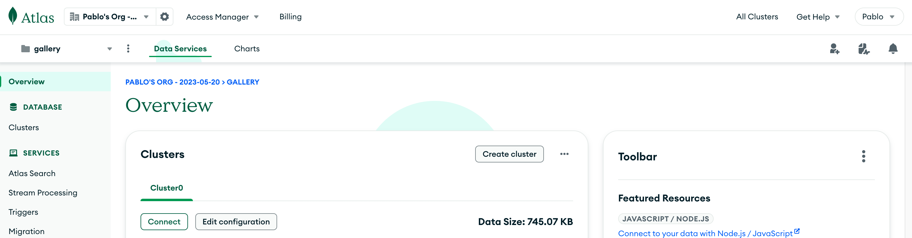

# Setting up the MongoDB database

Go to [MongoDB](https://www.mongodb.com/) and log in.

There are several ways to add a `new project` but one of the easiest to find is going to the cluster project page and pressing the `new project` button there.

