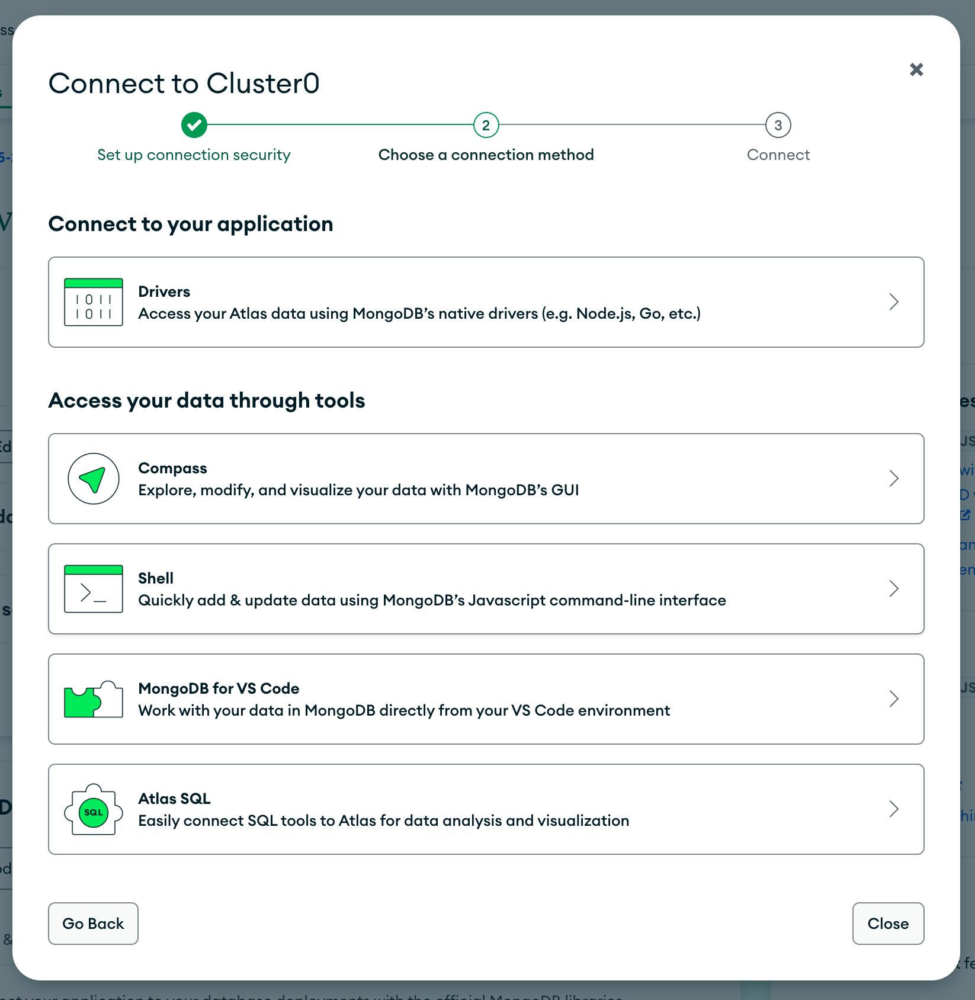

# Setting up the MongoDB database

Go to [MongoDB](https://www.mongodb.com/) and log in.

|  |
| --------------------------------------------------------------------------------------------------------- |

There are several ways to add a `new project` but one of the easiest to find is going to the cluster project page and pressing the `new project` button there.

|  |
| ---------------------------------------------------------------------------------------------------------------------- |

Enter the new project's name and click next...

|  |
| ----------------------------------------------------------------------------------------------------------------- |

The next screen adds is an opportunity to add new members. I left myself as the owner and assumed that this would make me the database user but it is a little confusing exactly what this means in effect.

|  |
| ---------------------------------------------------------------------------------------------------------- |

Previously, I thought this project would naturally be in the one cluster that I have, but I was prompted to Create a new cluster which I did not really understand. It did however all work out fine, and it did become a part of my single Cluster 0.

|  |
| ------------------------------------------------------------------------------------------------------------------ |

I completed this choosing the free option and left the rest as default using the nearby Ireland region and the default AWS.

|  |
| ------------------------------------------------------------------------------------------------------------------ |

Next come the connection options. Obviously I changed the password from the one shown here. Later on force me to create a new Database User.

|  |
| --------------------------------------------------------------------------------------------------------------------- |

Not quite sure why this screen came up. Just another screen to plow through to get to the connection strings.

|  |
| ----------------------------------------------------------------------------------------------------------------------------- |

Here is the point where I was forced to create a new database user to continue though it is not shown in the screenshot.

|  |
| ------------------------------------------------------------------------------------------------------------------------------------- |

The list to select the connection string needed. I have only ever needed `Drivers` for the API connection and `Compass` obviously to Compass.

|  |
| ------------------------------------------------------------------------------------------------------------ |

The `Drivers` page for the API connection string:

|  |
| ------------------------------------------------------------------------------------------------------------------------------ |

The `Compass` page for connecting to MongoDB Compass:

|  |
| ---------------------------------------------------------------------------------------------------------------------------------------------- |

## MongoDB Compass

Start the app and choose `New connection`.

Enter the connection string provided by MongoDB from your account and add in the correct password.

Give the project a name to avoid the horrible default shown in the screenshot and click `Save and Connect`.

|  |
| ---------------------------------------------------------------------------------------------------------------------------------- |

Find this project in the list and click `+` to add a new database.

|  |
| ------------------------------------------------------------------------------------------------------------------------ |

Give it an appropriate name and first collection name.

**NOTE:** If you plan to have different databases to dev, production, test, etc. then this is a good time to think about that in your naming, e.g. this example is called `todo_DEV` rather than simply `todo`.

|  |
| ----------------------------------------------------------------------------------------------------------------------- |

Click on that database to see the database which of course, will be empty.

|  |
| --------------------------------------------------------------------------------------------------------------- |

[NEXT: Setting up the repository](1b_setUp_repository.md)
